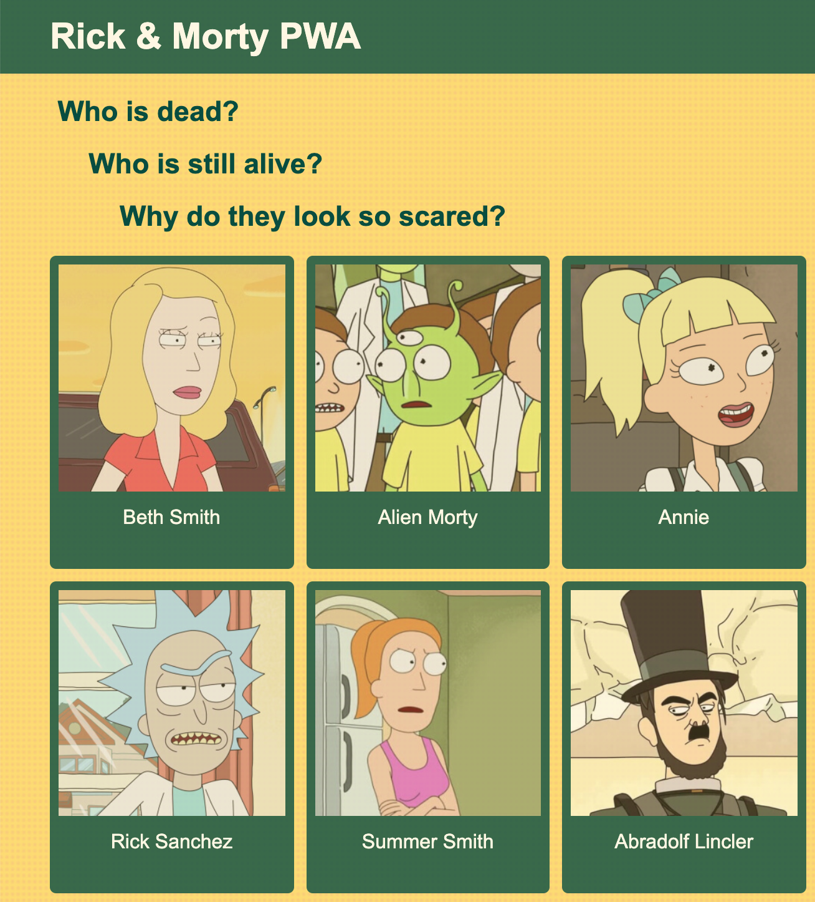
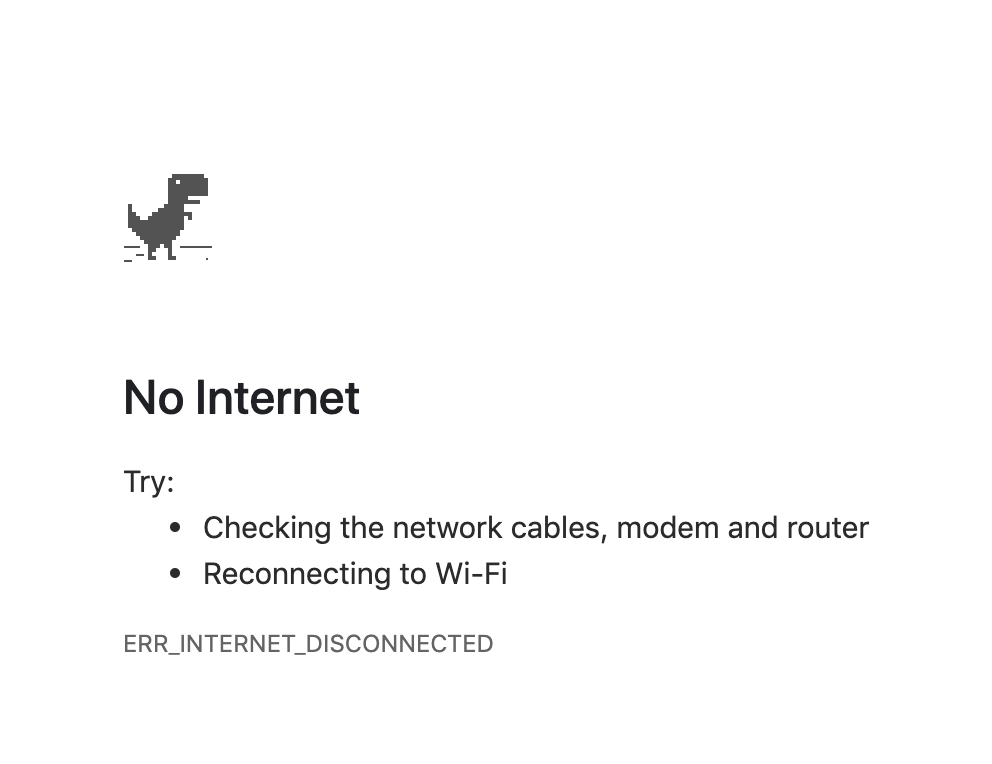
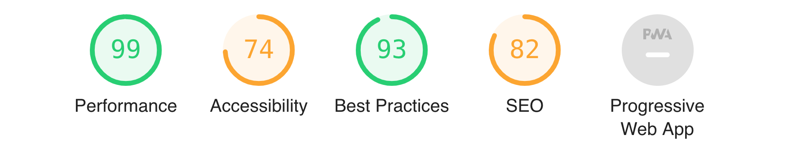

# Rick & Morty PWA Workshop

> How to create your own PWA with Workbox step by step.

## Up and running

```bash
npm i
npm run build
npm start
```

Open thic URL in Chrome: [`http://localhost:1981/`](http://localhost:1981/)

## Our app

You are probably looking at something like this:



We are using [The Rick & Morty API](https://rickandmortyapi.com/) since it is free and funny and it doesn't need any authentication tokens.

On the home page we are collecting 20 random characters from the TV show. By clicking on one of them we navigate to its detail page where we find out if the character is dead or alive. Then we can navigate back to home and keep playing with this simple app.

## Go offline

Open up the Chrome DevTools and go offline.

> Tip: use `cmd + shift + p` for Mac or `ctrl + shift + p` for Windows and type "offline".

Reload the page.

You should see this:



Play with it using the space bar. How much do you score in the offline Dino Game?

Anyway, as you can see we have lost everything. This exactly what we are trying to avoid by making a PWA.

## Audit with Lighthouse

Lighthouse is an excellent tool to improve the quality of web pages.  It has audits for performance, accessibility, progressive web apps, and more. It is pre-installed in all Chrome browsers and you can either run it from the DevTools or from a Node command.

In our case we are ready to run our npm script, generate the corresponding report on HTML and open it up automatically in our browser.

```bash
npm run lighthouse
```



Now click on the Progressive Web App link (top left).

Notice that there are a lot of things in red:

* <span style="color:red">Current page does not respond with a 200 when offline.</span>
* start_url does not respond with a 200 when offline
* Does not register a service worker that controls page and start_url
* Web app manifest does not meet the installability requirements
* Does not redirect HTTP traffic to HTTPS
* Is not configured for a custom splash screen
* Does not set an address-bar theme color
* Does not provide a valid apple-touch-icon