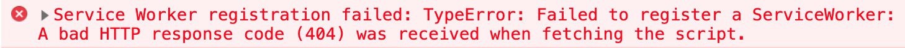
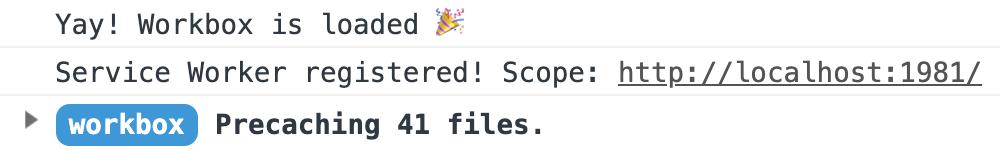
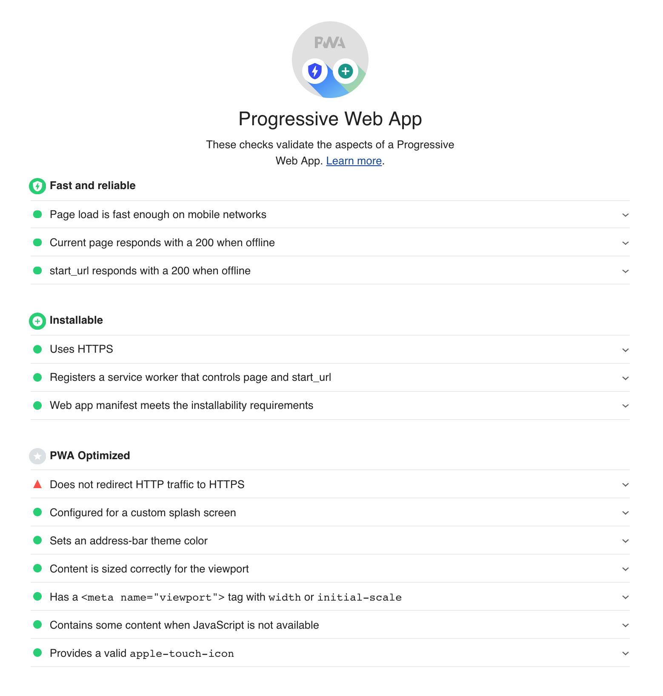

# Rick & Morty PWA Workshop -> Step 2

## Register the service worker

Add the following code to your `src/index.html` file, right before the closing `</body>` tag:

```html
<script>
  if ('serviceWorker' in navigator) {
    window.addEventListener('load', () => {
      navigator.serviceWorker.register('/sw.js').then(
        registration => {
          console.log(`Service Worker registered! Scope: ${registration.scope}`);
        },
        error => {
          console.error(`Service Worker registration failed: ${error}`);
        }
      );
    });
  }
</script>
```

```bash
npm run build
```

If you start the app you should see an error message:



Of course. We have not created our service worker yet.

## Copy Workbox libraries

Take a look at your `package.json`. One of the installed `devDependencies` is the `workbox-cli`. As already mentioned workbox is not a library but a set of libraries. This means that you cannot just install all the libraries with an npm command. However with the help of the `workbox-cli` package we can copy those libraries to the `dist` folder during the build process.

In the [Workbox documentation](https://developers.google.com/web/tools/workbox/guides/get-started#importing_workbox) they recommend to import Workbox from the Workbox Content Delivery Network (CDN) but this is not a good practice. Check out [this Jake Archibald's post](https://jakearchibald.com/2018/third-party-css-is-not-safe/) where he talks about third party scripts.

Instead of that we are going to serve the libraries ourselves. Go to `package.json` and add a sequential (non parallel) execution at the end of the "build" script: `npx workbox copyLibraries dist/scripts`.

If you don't know the difference between sequential and parallel execution in npm scripts check out this [Stack Overflow question](https://stackoverflow.com/questions/39172536/running-npm-scripts-sequentially/39172660#answer-39172660)

Copy the workbox libraries in `dist/scripts`.

```bash
npm run build
```

## Create the App Shell

An application shell is the minimal HTML, CSS, and JavaScript powering a user interface. You can think of it as the bundle of code you'd publish to an app store if you were building a native app.

Workbox handles 2 types of caching:

* Precaching: is performed during the service worker installation and it takes a precache manifest.
* Runtime caching: is performed on fetch events.

Be careful not to mistake precache manifest with web app manifest. The precache manifest only specifies the files that are going to be precached by our service worker. This is the App Shell.

The first thing we need is a file for our custom service worker. Create it in `src/sw-custom.js`.

```javascript
// Replace the x's in the string with the correct Workbox copied version!
importScripts('/scripts/workbox-vx.x.x/workbox-sw.js');

if (workbox) {
  console.log(`Yay! Workbox is loaded 🎉`);

  workbox.setConfig({
    // Replace the x's in the string with the correct Workbox copied version!
    modulePathPrefix: '/scripts/workbox-vx.x.x/'
  });

  workbox.precaching.precacheAndRoute([]);
} else {
  console.log(`Boo! Workbox didn't load 😬`);
}
```

`importScripts()` method belongs to any worker global scope and allowes us to import one or more scripts into the current worker's scope. Fill in the corresponding Workbox version so that this method doesn't fail.

`workbox.precaching.precacheAndRoute([])` is just a placeholder. The precache manifest will be generated inside it in our final `dist/sw.js`. 

Let's generate our service worker.

```bash
npx workbox wizard --injectManifest
```

The Workbox wizard asks a series of questions. You can find out the answers by looking at what should be the resulting `./workbox-config.js`:

```javascript
module.exports = {
  globDirectory: 'dist/',
  globPatterns: ['**/*.{png,jpeg,html,css,json,ico,js}'],
  swDest: 'dist/sw.js',
  swSrc: 'src/sw-custom.js',
  // Replace the x's in the string with the correct Workbox copied version!
  globIgnores: ['scripts/workbox-vx.x.x/**/*']
};
```

Select all types of files when you are prompted with that question. In the end a `workbox-config.js` file should be created in your project root folder.

The `globIgnores` property should be added manually. We specify that property because we just don't need to cache the Workbox libraries.

Now that we have our configs we can mofify the precache manifest placeholder in `sw-custom.js`.

```javascript
workbox.precaching.precacheAndRoute([], {
    // Ignore all URL parameters.
    ignoreURLParametersMatching: [/.*/]
  });
```

The `ignoreURLParametersMatching` property is used to avoid problems with our URL query parameters.

But you need to do one more thing. Go to `package.json` and add another sequential execution at the end of the "build" script: `npx workbox injectManifest`.

Now build it.

```bash
npm run build
```

Notice that we have now copied both `dist/sw.js` and `dist/scripts/workbox-libs/workbox-vx.x.x`.

Open the final service worker file and see what a precache manifest really looks like. The `workbox-cli` automatically adds revision hashes to the files in the manifest entries. This way Workbox intelligently tracks files that have been modified or are outdated, and automatically keep caches up to date with the latest file versions. It also removes cached files that are no longer in the manifest, keeping the amount of data stored on a user's device to a minimum.

But that is not the only benefit of using Workbox. Keep in mind that if we had written this on Vanilla JS we would have need to write the whole boilerplate from the 3 service worker lifecycle events: `load`, `install` and `activate`. Workbox wraps this complexity for us and solves everything in 1 (`precacheAndRoute`) shot instead of 3.

## Verify changes

Probably your console is looking much better now:



On the other hand, let's run Lighthouse again:

```bash
npm run lighthouse
```

Another beautiful sight:



This is what a modern web app should look like!

Click [here](https://github.com/kaplan81/rick-morty-pwa-workbox/tree/step-03-offline-experience) to navigate the instructions of the next step. 

## If you didn't make it

```bash
git checkout step-02-app-shell
git branch step-02-app-shell-mine
```
