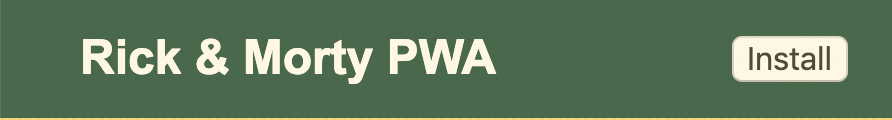
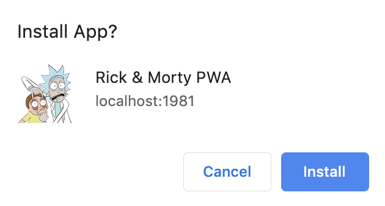
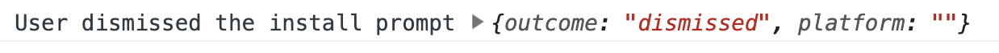
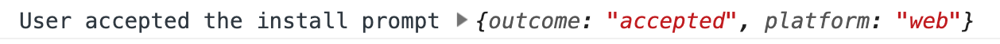
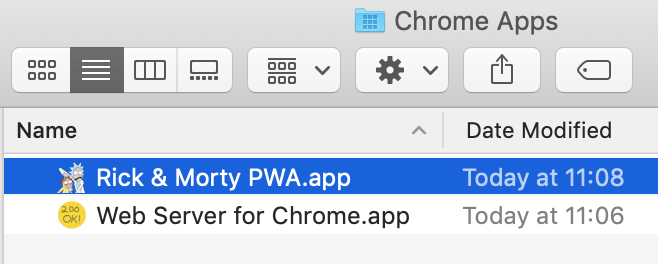
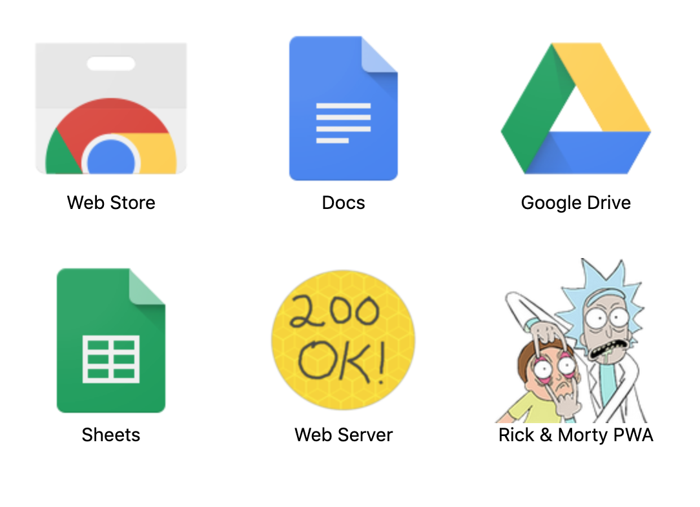
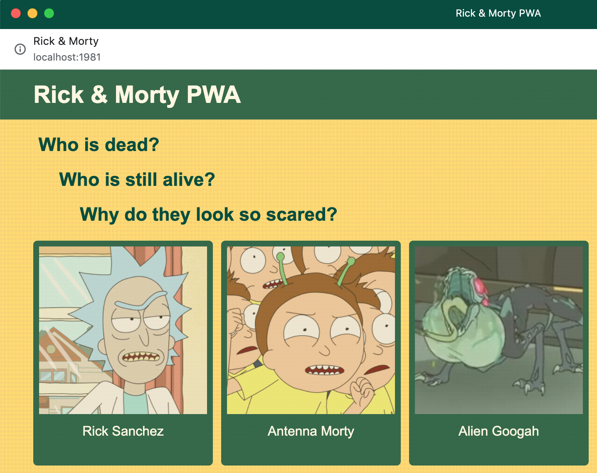

# Rick & Morty PWA Workshop -> Step 4

## Install Button

Now if you want to install your app you need to go to the three-dot context menu and click on "Install Rick Morty PWA...". But we can do better.

In `src/index.html` provide a `<button>Install</button>` to the header, after the anchor tag. Add the classes `install-btn` and `hidden` to it. The latter will make the element to have a `display: none;`.

Go to `app.scss` and use `install-btn` class to make it look nicer. Of course this is optional.

## Install Script

OK. Now that we have our button we just need to create an script to handle it. Provide it in `src/index.html` too:

```html
<script src="/scripts/install.js"></script>
```

The first thing you need in this script are 2 variables: one for the button element and another one for the `beforeinstallprompt` event that we initialize to `null`:

```javascript
const installButton = document.querySelector('.install-btn');
let deferredInstallPrompt = null;
```

Then 2 events: 

```javascript
window.addEventListener('beforeinstallprompt', saveBeforeInstallPromptEvent);
installButton.addEventListener('click', installPWA);
```

Now you need to declar those 2 callback functions: `saveBeforeInstallPromptEvent` and `installPWA`.

Try to write the first one from scratch. It receives the `beforeinstallprompt` as an `event` parameter and saves it in the `deferredInstallPrompt` variable. It also makes the button visible by removing the `hidden` class.

Done? OK.

The second function prompts the banner, hiddes the button and depending on the user's choice shows a different message in the console. Just copy it and paste it:

```javascript
function installPWA(evt) {
  // Add code show install prompt & hide the install button.
  deferredInstallPrompt.prompt();
  // Hide the install button, it can't be called twice.
  evt.srcElement.classList.add('hidden');
  // Log user response to prompt.
  deferredInstallPrompt.userChoice.then(choice => {
    if (choice.outcome === 'accepted') {
      console.log('User accepted the install prompt', choice);
    } else {
      evt.srcElement.classList.remove('hidden');
      console.log('User dismissed the install prompt', choice);
    }
    deferredInstallPrompt = null;
  });
}
```

## Try it out

Build everything and reload the page. You should see the install button.



Now click on install. Don't be afraid.



Reject the installation this time and take a look at the console.



No do the same but accept the installation. You will be prompt with a couple of things but first take a look at the new console message.



The app should be now installed among other of our apps in your system.



And also if you navigate to your Chrome Application in your browser.



And the app itself should display in its own window.




## This is it

You did it! If you got here it means that you are already a PWA developer.

Congratulations!

## If you didn't make it

```bash
git checkout step-04-install-experience
git checkout -b step-04-install-experience-mine
```