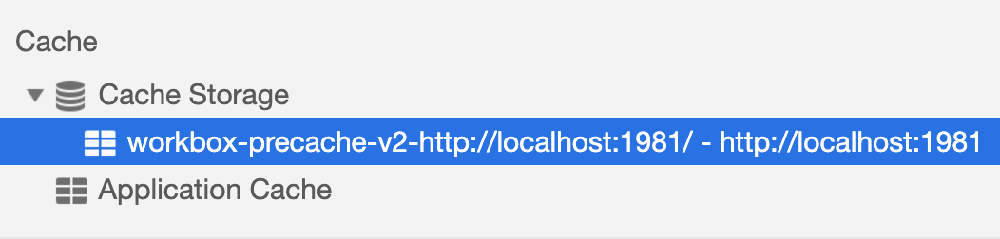
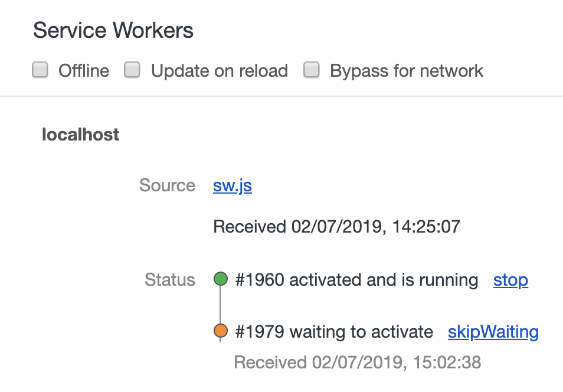
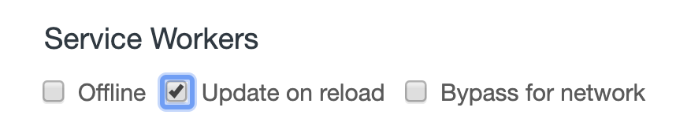
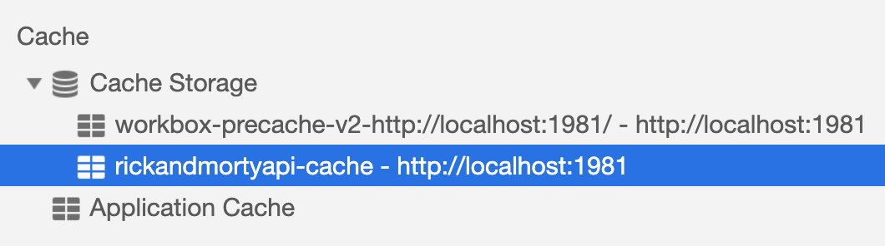
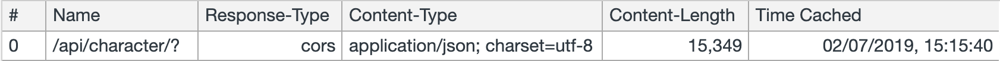
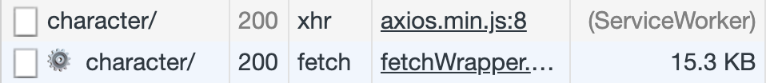
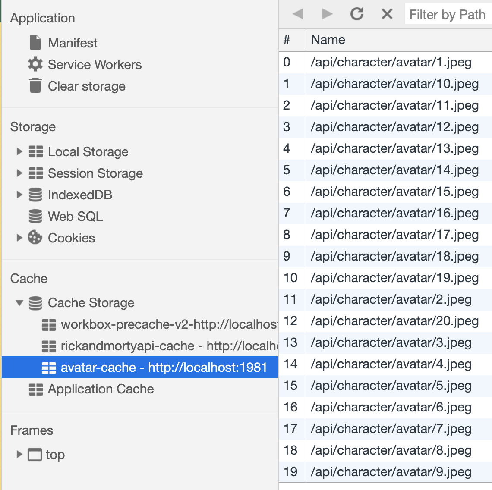
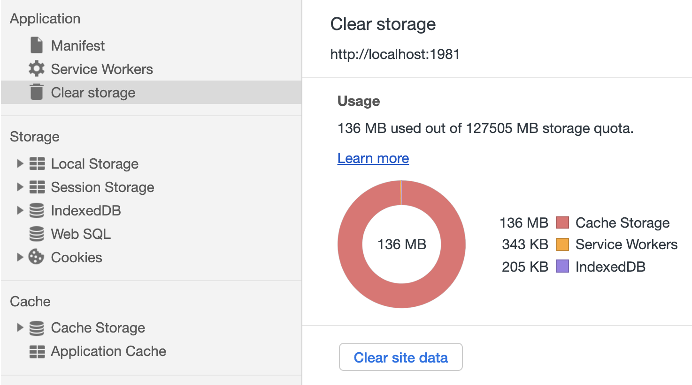

# Rick & Morty PWA Workshop -> Step 3

## Go offline again

Activate again this checkbox from your DevTools.

Now reload the page. From now on every time you reload you may have to get rid of this possible habit of yours (as a developer) of reloading without cache. Remember to do `cmd + r` instead of `cmd + shift + r`. That is important.

What do you see? It is the App Shell. We lost our dear offline dinosaur.


Nevertheless there is no content when we are offline because that is not just static files served by us. It is a response to a HTTP request and we need to cache it on runtime.

## Cache the API route

Go online again and reload the page.

Go to your DevTools Application tab and check on the Cache Storage section.



Look to the right. All our app shell, all the files specified in the `dist/sw.js` are cached there with their corresponding revision hash.

Now we need to cache the responses to the `rickandmortyapi` API.

The base URL we are using is `https://rickandmortyapi.com/api/character`. Then we got 3 different endpoints:

1. `/?` gets all the characters. We use it on the home page.
2. `/1` gets the character with id 1. We use it on the character page.
3. `/avatar/1.jpeg` gets the picture (or avatar) of character with id 1. We use it on both pages.

Checkout the 3 combinations in your browser.

We are going to use `workbox.routing.registerRoute()` method to cache routes in runtime. In order to do that we need to use regular expressions for 2 cases:

A. Match retrieved data but not subsequent image requests. In other words: get all calls to the characters but not to their avatar images. That also means: match endpoint 1 AND 2 but NOT 3.

B. Match only the calls to avatar images.

So let's start only with **case A**. This is probably the most difficult part of this exercise. We all have problems from time to time with regular expressions so if you cannot figure it out just look at the code of this branch for the solution or ask your instructor to send the regular expression string to you.

But the pattern to match is not the only parameter to the `workbox.routing.registerRoute()` method. We also need a caching strategy.

Since new characters can die as the TV shows goes on, we need to have the most up-to-date information so we will use the **Network First** caching strategy (falling back to cache).

If you want to know more about the most common (runtime) caching strategies take a look at the [Workbox documentation](https://developers.google.com/web/tools/workbox/guides/route-requests#handling_a_route_with_a_workbox_strategy). The `workbox.strategies` package takes care of the implementation of those ones.

Go to `src/sw-custom.js` to add the necessary runtime caching. Copy and paste this template right after the `precacheAndRoute` snippet.

```javascript
workbox.routing.registerRoute(
  // Replace with the correct regular expression.
  /https:\/\/regularexpression\.com\/for\/api-url/,
  // Replace MyCachingStrategy with the correct caching strategy method.
  new workbox.strategies.MyCachingStrategy({
    // Replace 'my-cache-name' with the correct cache name.
    cacheName: 'my-cache-name',
    // Add the corresponding plugins.
    plugins: []
  })
);
```

* Make a unique name for this `cacheName`. Use for example `rickandmortyapi-cache`. For the precache Workbox follows the `workbox-precache-xxx` naming convention. If we would not specify a `cacheName` it would do the same but with `workbox-runtime-xxx`.
* Replace `MyCachingStrategy` with the correct method for the Network First caching strategy. It is in the mentioned [docs](https://developers.google.com/web/tools/workbox/guides/route-requests#handling_a_route_with_a_workbox_strategy).
* Use the Workbox Expiration Plugin to limit the cached entries to 20 (with the `maxEntries` property) since the API is only giving us that many. For that take a look at how how to implement a Workbox plugin [here](https://developers.google.com/web/tools/workbox/guides/using-plugins#workbox_plugins).
* As per how to build up the regular expression you could first replace the API base URL and then add the `()` capturing group that tells the regex to "match something only if that something is NOT followed by other something (in this case by `\/avatar`). Find out by looking at [this Mozilla doc](https://developer.mozilla.org/en-US/docs/Web/JavaScript/Guide/Regular_Expressions).

## A new service worker

```bash
npm run build
```

What you are building now is a new version of your service worker because more than one byte of the file has changed. The browser detects that automatically and assigns a new id number to it. But if instead of performing the change on `registerRoute()` we would have changed the `workbox-config.js` and therefore our app shell then the name of the key for the Cache Storage would have needed to be re-assigned too. We are lucky that Workbox handles that for us. Otherwise we would have to change that key manually every time that the files to precache vary.

Go to your DevTools Application tab again and see what has happened there.



The service worker lifecycle ensures that the page is controlled by only one version of the service worker at a time. In this moment the old service worker with id 1960 is still active and the new one with id 1979 is waiting to be activated. We can activate the new service worker in different ways:

* By closing al the windows (tabs) with the same origin (protocol + hostname + port) and then open again the app in a new one.
* By clicking on `skipWaiting`.
* By adding the `self.skipWaiting()` method to our service worker.
* By activating the "Update on reload" checkbox and then reloading the page.



The best practice is to go for Update on reaload so do that reload the page (remember: WITH cache).

Now the new service worker is active and we have a new cache slot.



If you implemented this route correctly you should see the cached response too:



And you couldn't do better than taking a peek at the Networt tab. You may find this interesting.



If there ir a gear icon on the request it means that this is a request made by the service worker. The one without the gear icon is the served response which comes from the service worker and therefore from the Cache Storage.

## Cache the images

But what happens if we go offline again? Well...


We have cached the response from the server but then some resorce URLs are making extra calls to get the individual images. We are not caching that yet and that is why we can only see the precached placeholder image on each of the characters.

> Tip: if you did not make it with the fisrt regular expression there is the possibility of cheating by looking at [`src/sw-custom.js`](https://github.com/kaplan81/rick-morty-pwa-workbox/blob/step-03-offline-experience/src/sw-custom.js) of this (step 03) branch. 

So, as mentioned previously, **case B** consists of caching the images. These are avatars so we don't need to constantly have the most up-to-date version of them. The **Stale While Revalidate** strategy seems to fit our needs here. With that will only use responses from the cache BUT we will also make a call to the network and if that call is successful we cache that response for the next time. Pretty neat, right?

So...

* Duplicate the `registerRoute` snippet. It will be your template for this case.
* Name it `avatar-cache` this time.
* Replace `NetworkFirst` with the correct method for the Stale While Revalidate caching strategy. Get it also from the [docs](https://developers.google.com/web/tools/workbox/guides/route-requests#handling_a_route_with_a_workbox_strategy).
* Use the Workbox Expiration Plugin again to limit the cached entries to 20 and, additionally, limit the time (with the `maxAgeSeconds` property) to a week. You can take a look again at the [Workbox docs on Plugins](https://developers.google.com/web/tools/workbox/guides/using-plugins#workbox_plugins).
* As per how to build up the regular expression this time, you can start by replacing `(?!\/avatar)` with just `\/avatar`, since this time we want to match that endpoint. Moreover we need to match whatever string that right next to that also contains a `()` capturing group that matches any character 0 or more times, plus an escaped dot (the dot of the file extension), plus a `(?:)` non-capturing group that matches either `jpeg` or `jpeg`, since that is the image format.


Tick, tack, tick, tack, tick, tack,...

Did you get it? Awesome. So you know what to do now...

```bash
npm run build
```

...and reload. Look at that.



Now your whole app should run perfecly offline!

## If you get in trouble

If either the cache or the service workers behave funny and have the need for a fresh start you can always call on a very useful utility from the DevTools. Go to the Application -> Clear Storage section and click on "Clear site data". This will not only remove the storage from this origin but it will also unregister all existing service workers.



Just remember that if you do that you will need to reload twice to see the runtime caches since on the first load you only get the precached files. The rest of the information gets cached during this first life of the app so we will only be able to see it on a second round.

Try it!

Click [here](https://github.com/kaplan81/rick-morty-pwa-workbox/tree/step-04-install-experience) to navigate the instructions of the next step.

## If you didn't make it

```bash
git checkout step-03-offline-experience
git checkout -b step-03-offline-experience-mine
```